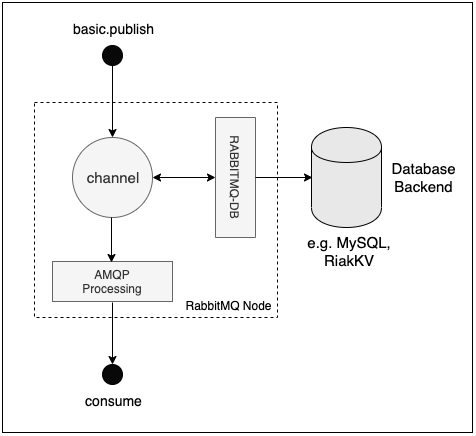

# RabbitMQ Database Plugin


The RabbitMQ Database Plugin is a tool used store messages published to a RabbitMQ node or cluster, along with their properties, in a database backend engine of choice. On the configured database backend engine, e.g. [PostgreSQL](https://www.postgresql.org/), [MySQL](https://www.mysql.com/), [MSSQL](https://www.microsoft.com/en-in/sql-server/sql-server-2019), [RiakKV](https://docs.riak.com/index.html), e.t.c, the plugin creates a database of name `rabbitmq-db`, where it further creates 3 tables for storing messages and their properties upon interception when published to a RabbitMQ node or cluster. The tables created and used for storing messages and their metadata are:

- `rabbitmq-message`
- `rabbitmq-message-properties`
- `rabbitmq-message-properties-encoded`

### Design

The RabbitMQ DB plugin operates by intercepting messages inbound to a RabbitMQ node. When a `basic.publish` AMQP operation is issued by a connected client application, the message will be intercepted, mediated and captured for storage to the configured database engine. The overview design is illustrated in **Fig-1** below:



**Fig-1: RabbitMQ Database Plugin Overview Design**


## Supported RabbitMQ Versions

This plugin is compatible with **RabbitMQ 3.7.x** and beyond, to the latest release.

## Installation

### Packaging

Download pre-compiled versions from [https://github.com/Ayanda-D/rabbitmq_db/releases](https://github.com/Ayanda-D/rabbitmq_db/releases)

### Build

Clone and switch to branch `v3.7.x` to build the plugin for RabbitMQ versions `3.7.x`. Execute `make`. To create a package, execute `make dist` and find the `.ez` package file in the `plugins` directory.

Ensure the RabbitMQ version you are building/packaging for is compatible to the Erlang, as well as Elixir versions installed. For more detail on this, please refer to https://www.rabbitmq.com/which-erlang.html

### Testing

Likewise, clone and switch to branch `v3.7.x` and execute `make tests` to test the plugin. View test results from the generated HTML files.

## Configuration

The RabbitMQ Database Plugin uses [Ecto](https://github.com/elixir-ecto/ecto) to interface to different types of database backends, hence, to configuring the plugin, is configuring the [Ecto](https://github.com/elixir-ecto/ecto) backend to use in the `config.exs` file.

```
config :rabbitmq_db, RabbitDB.Repo,
  database: "rabbitmq-db",
  username: "root",
  password: "rabbitmq",
  hostname: "localhost"
```

## License and Copyright

(c) Erlang Solutions Ltd. 2017-2019

https://www.erlang-solutions.com/
